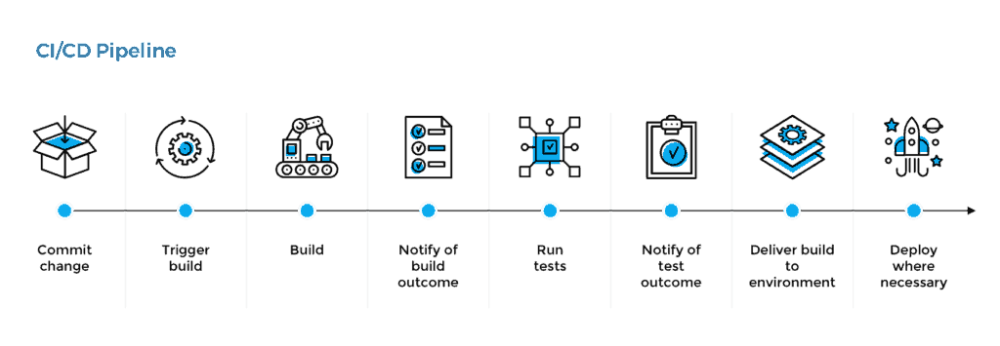

Pre-requisites:
---------------	
1. Build Automation(Maven, Gradel, Ant, etc)
2. Understanding of Centralised Code Repositories(Gitlab, Github, Bitbucket, etc)/Version control system(VCS)/Source Control Management(SCM).

What were they doing before CI/CD?
-------------------------------
1. GitLab code commit,
2. integrate,
3. pull the committed code,
4. build and
5. verify in the local system.
6. Deploy to STG/Testing.
7. Manual Testing.
8. Deployment in Production

What is Continuous Integereation?
---------------------------------
Continuous Integration (CI) is a development practice that requires developers to integrate code into a shared repository several times a day. Each check-in is then verified by an automated build, allowing teams to detect problems early.

Continuous Integration (CI) consists of “executing” the build process as frequently as possible (ideally whenever a code change is checked into the source code control repository) and “verifying” the correctness of the resulting product, in particular by unit tests.

What is Continuous Delivery?
----------------------------
Delivering software to production with manual intervention.

What is Continuous Deployment?
------------------------------
Delivering software to production in an automated method.

Why CI/CD?
----------
1. CI/CD includes the full automation of all steps between code commit to production deployment, thus reducing time and repeatable human works.
2. Implementing CI/CD allows teams to focus on building code and removes the overhead and potential human error in manual, mundane steps. 
3. CI/CD also makes the process of deploying new code quicker and less risky. 
4. Deployments then happen more frequently and in smaller increments, helping teams become more agile, more productive and more confident in their running code.

What tools should I use?
------------------------
Build Automation : Maven, Gradel, Ant, etc. 
Version Control  : Gitlab, Github, Bitbucket,etc. 
CI/CD            : Jenkins, Teamcity, TravisCI, CircleCI, Bamboo, GoCD, etc. 
Deployment       : Octopus Deploy

CI/CD Check List:
-----------------
1. Build process should be under ten minutes.
2. Notifying about Build results(success/failed/stuck).
3. 

Reference Links:
----------------
[Microsoft's what is devops](https://azure.microsoft.com/en-in/overview/what-is-devops/#practices)  
[Plutora's understanding ci/cd pipeline](https://www.plutora.com/blog/understanding-ci-cd-pipeline)  
[Agilealliance's Automated build](https://www.agilealliance.org/glossary/automated-build/)
(This page is created by AATHITH(myself) for my self-reference only.)
